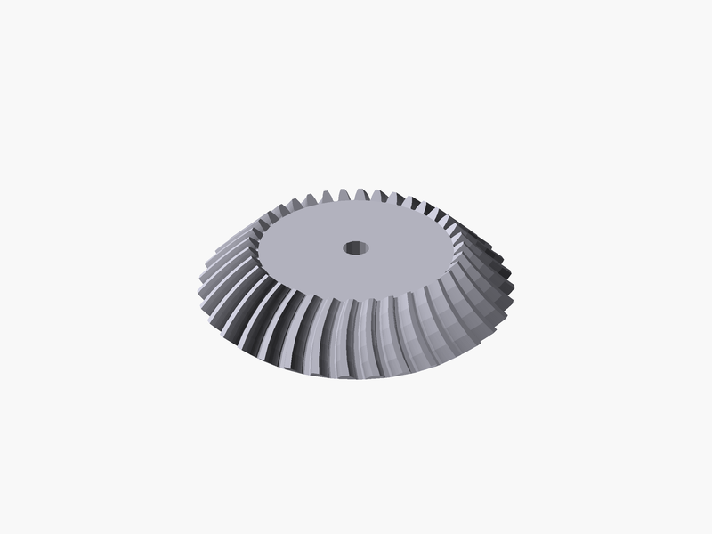
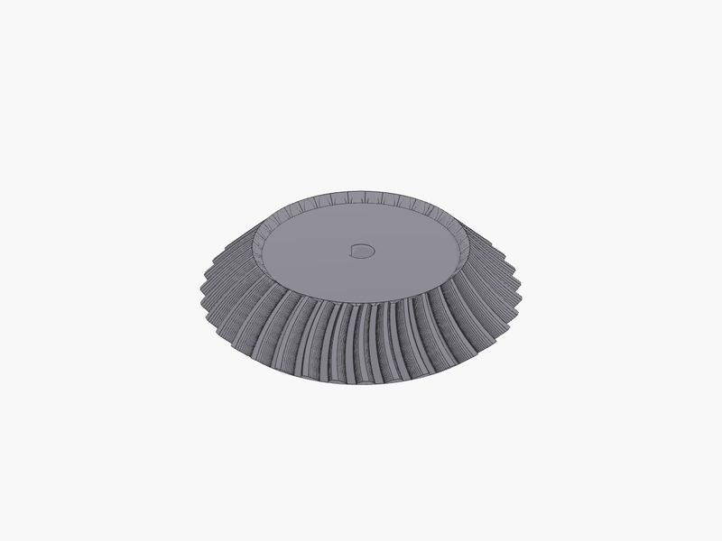
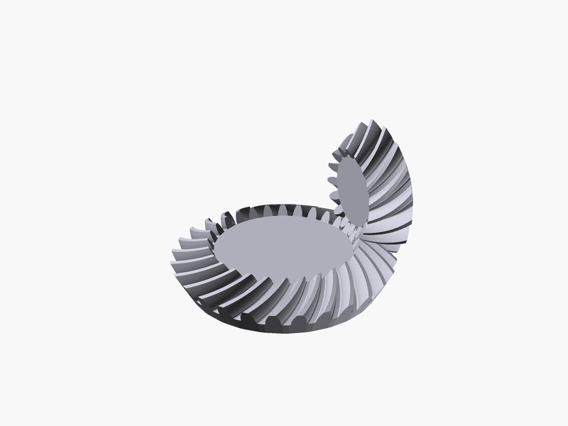
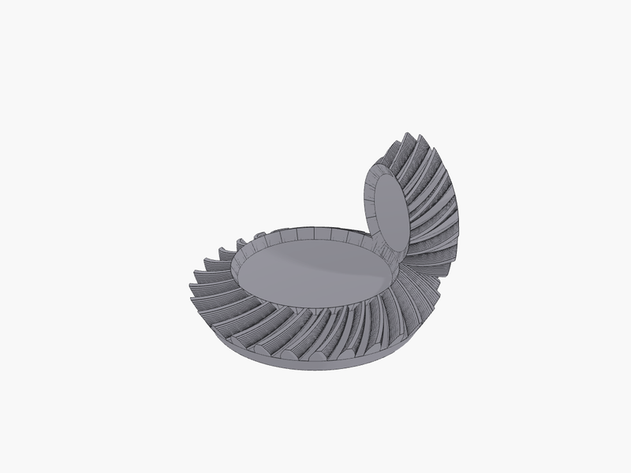
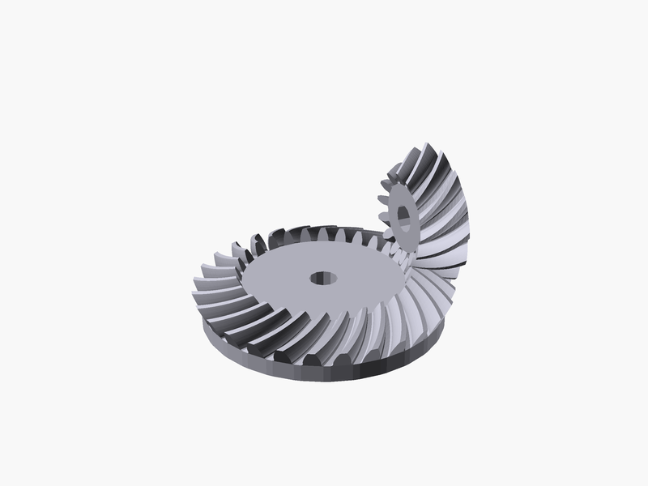
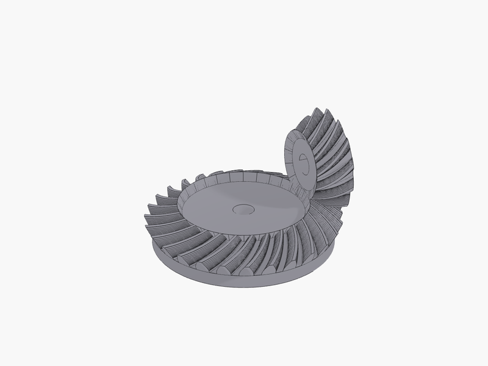

# Reproducing BOSL2's `bevel_gear()` examples

[BOSL2](https://github.com/BelfrySCAD/BOSL2) is the de facto standard library for OpenSCAD, and
`gears.scad` is one of its most used modules. This page reproduces the three worked examples
from its
[`bevel_gear()` documentation](https://github.com/BelfrySCAD/BOSL2/wiki/gears.scad#functionmodule-bevel_gear)
on OCCTSwift's B-Rep kernel, next to the OpenSCAD originals, and says plainly where the two
disagree and by how much.

Every figure on this page is generated locally by
[`render.sh`](bosl2-bevel-gears/render.sh); nothing is copied from the BOSL2 wiki. Both sides of
each pair are rendered from the same eye point with the same projection, so a difference in the
pair is a difference in the geometry rather than in the framing.

> BOSL2 is BSD-2-Clause, Copyright 2017-2019 Revar Desmera. The parameterisation and the math on
> the OCCTSwift side are ported from `gears.scad`, with the attribution repeated in the header of
> each ported script. This repo is LGPL-2.1; permissive into copyleft is compatible, and no
> dependency is added, only algorithms.

## What was ported, and what was not

BOSL2's `bevel_gear()` is about 165 lines, and roughly 120 of them are VNF vertex and face index
bookkeeping that ends in a `polyhedron`. None of that was ported. A literal port would put
faceted polygon soup inside a `.brep` file: unfilletable, and a poor STEP export, which is to say
it would throw away the reason to use a B-Rep kernel at all.

**Ported:** the parameterisation and the math. Pitch radius, `bevel_pitch_angle`, the cone radii
and face width, the involute tooth profile, the Gleason face-mill cutter arc that defines the
lengthwise tooth trace, the backing formulas, the handedness mirror, and the three named anchors.

**Reimplemented:** the construction. A meridian profile is faced and revolved into a blank, one
tooth-space cutter is lofted through the cutter-arc stations, and
`Shape.circularPatternCut` removes it N times. Backing is a second revolve unioned on; the bore is
a cylinder subtracted. The result is a real solid: every script here asserts
`subShapeCount(ofType: .solid) >= 1` on the raw result of every stage, and nothing calls `heal()`
or `fixSolid()`, both of which reach `isValid == true` by demoting Solid to Shell.

**Replaced:** BOSL2's `anchor` / `spin` / `orient` attachment system, which has no OCCT analogue
and is thousands of lines. In its place are three plain heights along the gear's own axis
(`pitchbase`, `flattop`, `apex`) and ordinary `translated` / `rotated` calls. See
[the decision record](https://github.com/SecondMouseAU/OCCTSwiftScripts/blob/main/okf/decisions/bevel-gear-explicit-reference-frames.md).

## Running the examples

```bash
swift run occtkit run docs/guides/bosl2-bevel-gears/example1.swift --format brep --output /tmp/ex1
swift run occtkit run docs/guides/bosl2-bevel-gears/example2.swift --format brep --output /tmp/ex2
swift run occtkit run docs/guides/bosl2-bevel-gears/example3.swift --format brep --output /tmp/ex3
```

Each script prints its own measurements as it builds and stops on a failed check rather than
emitting a body it cannot vouch for. The reference side needs OpenSCAD with BOSL2 installed:

```bash
openscad -o /tmp/ex1.png --imgsize=800,600 --colorscheme=Tomorrow \
    docs/guides/bosl2-bevel-gears/example1.scad
```

`render.sh` runs both sides plus the numeric comparison:

```bash
docs/guides/bosl2-bevel-gears/render.sh --compare
```

## Example 1: bevel gear with zerol teeth

```openscad
bevel_gear(
    circ_pitch=5, teeth=36, mate_teeth=36,
    shaft_diam=5, spiral=0
);
```

```swift
let gear = buildGear(
    GearParams(teeth: 36, mateTeeth: 36, spiralDeg: 0, cutterRadiusSpec: .defaulted,
               slices: 5, shaftDiam: 5),
    label: "Example 1")

let placed = anchoredAtPitchbase(gear.shape, gear.frames)
try ctx.add(placed, color: C.steel, name: "bevel_gear 36t zerol, shaft_diam=5")
```

Full script: [`example1.swift`](bosl2-bevel-gears/example1.swift). Reference:
[`example1.scad`](bosl2-bevel-gears/example1.scad).

| BOSL2 2.0.747 / OpenSCAD 2026.06.12 | OCCTSwift 1.17.0 |
|---|---|
|  |  |

**`spiral=0` does not mean straight teeth.** With `cutter_radius` left undefined it resolves to
`face_width*2/cos(spiral)`, a real arc, so the lengthwise trace stays curved and only the spiral
angle at mid-face is zero. That is a **zerol** gear. Straight teeth need `cutter_radius=0`, which
BOSL2 fakes with `face_width*100` and which also forces `slices=1`. The script asserts the
distinction: the trace's angular offset is 0.0000 degrees at mid-face and +1.21 / +1.83 degrees at
the two ends, same sign at both, which is the zerol signature. A straight cutter would put all
three within rounding of zero.

**Measured against the reference mesh**

| | BOSL2 | OCCTSwift | delta |
|---|---|---|---|
| volume | 19372.29 mm3 | 19272.12 mm3 | **-0.517%** |
| bounding box (radius) | 29.7737 mm | 29.7506 mm | -0.023 mm |
| bounding box (z) | -1.4067 .. 10.3449 | -1.4067 .. 10.2996 | 0.000 / -0.045 mm |
| surface deviation, OCCT to BOSL2 | | mean 0.030, median 0.021, p95 0.111, max 1.137 mm | |
| surface deviation, BOSL2 to OCCT | | mean 0.027, median 0.025, p95 0.064, max 0.079 mm | |

The deviation figures are quoted after rotating the OCCT gear by **+5.043 degrees**, which is
0.504 of the 10 degree tooth pitch. That offset is a convention, not an error: this port cuts a
tooth SPACE centred on the +Y axis where BOSL2 places a TOOTH there, so a single gear compared as
built is half a pitch out of phase. It cancels in a meshed pair, because both members carry the
same offset (see Examples 2 and 3, which mesh without adjustment).

**Divergences, in order of size**

1. **No root fillet.** BOSL2 rounds the clearance valley with a radius of
   `min(maxr, clearance, ...)`, which here is the clearance, 0.398 mm. The OCCTSwift valley
   corner is sharp. This accounts for most of the missing volume and for the deviation tail: the
   worst 1% of deviation points sit at 0.55 to 0.67 of the tip radius, which is the root region.
2. **The back face sits about 0.048 mm apart.** BOSL2's root land is a straight line tangent to
   the root circle at mid-gap, so its ends dip below the root radius, and its lowest profile point
   is what the whole body is levelled on. The blank here is levelled on the root radius itself.
   Across a hub of radius 27.2 mm that is roughly 112 mm3, or 0.58%, of material BOSL2 keeps.
3. **The bore is a 12-sided prism in BOSL2** (`$fn=max(12, segs(shaft_diam/2))`, gears.scad:2701)
   and a true cylinder here, so BOSL2 keeps about 8.9 mm3 more material in the bore.
4. **B-Rep against mesh.** BOSL2's addendum cone is made of the tooth profiles themselves, so it
   is exact where the profile is; the OCCTSwift solid's cone is analytic, and the 0.023 mm
   bounding-box difference is the OCCT side's own STL triangulation reading slightly inside its
   own exact surface, not a difference in the solid. The exact B-Rep volume is 19272.59 mm3
   against the meshed 19272.12 mm3, a 0.002% meshing bias.
5. **No undercut simulation.** Not exercised here: 36 teeth is well above the 17-tooth undercut
   limit for a 20 degree pressure angle, so BOSL2's undercut pass does nothing either.

## Example 2: spiral bevel gear and pinion

```openscad
t1 = 16; t2 = 28;
color("lightblue")bevel_gear(
    circ_pitch=5, teeth=t1, mate_teeth=t2,
    slices=12, anchor="apex", orient=FWD
);
bevel_gear(
    circ_pitch=5, teeth=t2, mate_teeth=t1, right_handed=true,
    slices=12, anchor="apex", backing=3, spin=180/t2
);
```

```swift
let pinion = buildGear(GearParams(teeth: 16, mateTeeth: 28, slices: 12), label: "pinion")
let gear   = buildGear(GearParams(teeth: 28, mateTeeth: 16, slices: 12, rightHanded: true,
                                  backing: 3, coneBacking: true), label: "gear")

let pinionPlaced = orientedFWD(anchoredAtApex(pinion.shape, pinion.frames))
let gearPlaced   = spun(anchoredAtApex(gear.shape, gear.frames), degrees: 180.0 / 28)
```

Full script: [`example2.swift`](bosl2-bevel-gears/example2.swift). Reference:
[`example2.scad`](bosl2-bevel-gears/example2.scad).

| BOSL2 2.0.747 / OpenSCAD 2026.06.12 | OCCTSwift 1.17.0 |
|---|---|
|  |  |

**Colour.** BOSL2's own example paints the pinion `lightblue`. `occtkit render-preview` paints
every input body one fixed colour and has no flag to change it, so `example2.scad` overrides both
colours to match rather than leave the reader to read a palette difference as a geometry
difference. Restore BOSL2's own colouring with
`-D 'pinion_color="lightblue"' -D 'gear_color=[0.976,0.843,0.173]'`.

**Measured against the reference mesh**

| | BOSL2 | OCCTSwift | delta |
|---|---|---|---|
| volume (both bodies) | 13173.96 mm3 | 13089.57 mm3 | **-0.641%** |
| bounding box | -23.066 .. 23.269 | -23.052 .. 23.269 | at most 0.014 mm |
| deviation, 16t pinion to BOSL2 | | mean 0.032, median 0.017, p95 0.130, p99 0.385 mm | |
| deviation, 28t gear to BOSL2 | | mean 0.051, median 0.038, p95 0.121, p99 0.276 mm | |
| deviation, BOSL2 to OCCT | | mean 0.033, median 0.027, p95 0.097, max 0.156 mm | |

Best alignment came out at **0.507** of the pinion's tooth pitch and **0.497** of the gear's, the
same half-pitch convention offset as Example 1 and consistent across two different tooth counts.

**Handedness is right, and here is the check that could have said otherwise.** `right_handed`
inverts between BOSL2 and this port: `gears.scad:2640` reads
`lvnf = right_handed ? vnf1 : xflip(p=vnf1)`, and this port's per-slice transform stack already
carries BOSL2's own `xflip()`, which is the right-handed form. BOSL2 reaches its left-handed
default by mirroring a second time, so the extra mirror belongs on `right_handed == false`. A
volume comparison cannot see this, since a mirrored gear has exactly the same volume and bounding
box. The deviation measurement can: mirroring both OCCT bodies in X and re-running takes the mean
deviation from 0.032 and 0.051 mm to **0.370 and 0.367 mm**, and no rotation about the axis
rescues it (the scan over a whole tooth pitch runs 0.351 to 0.395 mm, essentially flat, against
0.044 to 0.545 mm for the correct hand).

**Meshing.** BOSL2's `spin=180/t2` interleaves the teeth, and it does so here too, even though
this port derives its tooth phase from its own tooth-space cutter rather than from BOSL2's tooth
profile. The boolean intersection of the two placed solids is **0.1005 mm3**, which is 0.18% of
one tooth space. A half-pitch phase error would bury a whole tooth in a whole gap and cost a large
fraction of that 55 mm3. The residual is faceting: both flanks are polylines, so each tooth is
marginally fatter than the exact involute and a zero-backlash pair cannot be exactly tangent.

**Divergences**

1. **BOSL2 undercuts the 16-tooth pinion and this port does not.** 16 teeth is below the
   17.1-tooth undercut limit at a 20 degree pressure angle, so BOSL2's rack-undercut simulation
   trims the pinion's flanks near the root. That is visible in the pinion's p99 of 0.385 mm
   against the gear's 0.276 mm, and it is the largest single geometric divergence on this page.
   Undercut simulation is out of scope for this port
   ([#84](https://github.com/SecondMouseAU/OCCTSwiftScripts/issues/84)).
2. **No root fillet**, as in Example 1.
3. **Conical backing** matches: the measured volume increase agrees with the analytic frustum,
   `pi*d/3 * (r0^2 + r0*r1 + r1^2)`, to 3e-9%. BOSL2 builds that frustum as a 56-sided prism
   through the root points; the OCCTSwift version is the solid of revolution the prism
   approximates.
4. **Apex placement is exact.** Each gear's apex height above its pitch base equals its mate's
   pitch radius to 4e-15 mm, checked against `pitch_radius(mate_teeth)`, a closed form that does
   not come from this port's own apex formula.

## Example 3: manual spacing, with cylindrical backing

```openscad
t1 = 14; t2 = 28; circ_pitch=5;
color("lightblue")back(pitch_radius(circ_pitch, t2)) {
  yrot($t*360/t1)
  bevel_gear(
    circ_pitch=circ_pitch, teeth=t1, mate_teeth=t2, shaft_diam=5,
    slices=12, orient=FWD
  );
}
down(pitch_radius(circ_pitch, t1)) {
  zrot($t*360/t2)
  bevel_gear(
    circ_pitch=circ_pitch, teeth=t2, mate_teeth=t1, right_handed=true,
    shaft_diam=5, slices=12, backing=3, spin=180/t2, cone_backing=false
  );
}
```

```swift
let pinionPlaced = movedBy(orientedFWD(anchoredAtPitchbase(pinion.shape, pinion.frames)),
                           SIMD3(0, pitchRadius(teeth: 28), 0))
let gearPlaced   = movedBy(spun(anchoredAtPitchbase(gear.shape, gear.frames), degrees: 180.0 / 28),
                           SIMD3(0, 0, -pitchRadius(teeth: 14)))
```

Full script: [`example3.swift`](bosl2-bevel-gears/example3.swift). Reference:
[`example3.scad`](bosl2-bevel-gears/example3.scad).

BOSL2 renders this one as a four-frame animation. The static `$t = 0` frame is reproduced; an
animation is not a goal, and at `$t = 0` both `yrot` and `zrot` are the identity.

| BOSL2 2.0.747 / OpenSCAD 2026.06.12 | OCCTSwift 1.17.0 |
|---|---|
|  |  |

**`cone_backing=false`** is the one genuinely new piece of geometry this page needed. Conical
backing continues the gear's taper; cylindrical backing attaches a plain cylinder at the root
radius. The measured volume increase matches the analytic cylinder `pi*r0^2*d` to 1.2e-9%, and the
two backing forms differ from each other by 6.85% of the cylinder volume for this gear, so
`cone_backing=false` is doing real work rather than quietly being a no-op.

**Placement is the interesting part.** Nothing here is anchored on its apex. Both members use
BOSL2's default `anchor="pitchbase"` and are then moved by BOSL2's own `pitch_radius` values, the
pinion by `back(pitch_radius(5, 28))` and the gear by `down(pitch_radius(5, 14))`. They only meet
at the origin because a gear's apex height above its pitch base equals its **mate's** pitch
radius. The script asserts that both apexes land within 4e-15 mm of the world origin, and unlike
the same statement in Example 2 (where both bodies were positioned by their apex, so agreement was
true by construction) this one would fail on a wrong apex formula.

**Measured against the reference mesh**

| | BOSL2 | OCCTSwift | delta |
|---|---|---|---|
| volume (both bodies) | 12036.37 mm3 | 11942.53 mm3 | **-0.780%** |
| bounding box | -22.991 .. 23.171 | -22.969 .. 23.171 | at most 0.030 mm |
| deviation, 14t pinion to BOSL2 | | mean 0.034, median 0.014, p95 0.123, p99 0.414 mm | |
| deviation, 28t gear to BOSL2 | | mean 0.053, median 0.044, p95 0.115, p99 0.251 mm | |
| deviation, BOSL2 to OCCT | | mean 0.035, median 0.028, p95 0.096, max 0.157 mm | |

**Divergences**: the same list as Example 2, with the undercut divergence larger because 14 teeth
undercuts more than 16 does. Interference between the placed pair is 0.0995 mm3, 0.19% of one
tooth space.

## How the two sides are compared

[`compare.py`](bosl2-bevel-gears/compare.py) reduces both sides to a triangle mesh and measures
them with the same code, so a difference in the numbers is a difference in the geometry rather
than in the measurement. Three measurements, in increasing order of what they can catch:

- **Volume**, by signed-tetrahedron sum. Cheap, and it does catch a systematically over-deep
  tooth valley. It is blind to handedness: a mirrored gear has exactly the same volume.
- **Bounding box.** Catches a misplaced or wrongly scaled body. Also blind to handedness.
- **Surface deviation**: the distance from every vertex of one mesh to the nearest point on the
  other mesh's *surface*, both ways round. This sees placement, tooth phase, profile shape, the
  lengthwise trace and faceting at once. One degree of freedom is fitted out first, the tooth
  phase, by scanning a whole tooth pitch of rotation about each body's own axis and reporting the
  residual at the best angle along with the angle. A gear of the wrong hand cannot be rescued by
  any rotation about its axis, which is what makes this measurement able to fail, and what the
  mirrored negative control in Example 2 demonstrates it actually does.

The OCCTSwift meshes are generated at 0.005 mm linear deflection, which puts the meshing bias at
0.002% of volume, well below every difference reported above.

### Camera matching

The two renderers have different vertical fields of view: OpenSCAD 22.5 degrees (measured, not
assumed: a 20 mm cube at the origin viewed from (0,0,100) covers 336 of 600 px), and
`occtkit render-preview` 45 degrees, which is `CameraState.fieldOfView`'s default. Moving one
camera to compensate would change the perspective as well as the framing. Instead both cameras sit
at the same eye point looking at the same target with the same up vector, and the occtkit frame is
cropped afterwards to the central `tan(11.25) / tan(22.5) = 0.4802` of each dimension. Cropping a
perspective image to a narrower field is exactly what a narrower lens from the same eye point
would have produced, so after the crop the two projections are identical.

Two things are still not matched, and are called out rather than papered over:

- **Material, lighting and edge shading.** These are different renderers. The OCCTSwift side uses
  `--display-mode shaded-with-edges`, because in plain `shaded` the tooth flanks of a part this
  size have too little tonal contrast to read at 800x600.
- **Body colour.** `occtkit render-preview` paints every input body one fixed colour, so the
  `.scad` files override theirs to match.

One workaround is baked into `render.sh`: `render-preview --camera-position P --camera-target T`
places the camera at the reflection of `P` through `T`, so the scene renders from the opposite
side. Verified on a single bevel gear on the +Z axis, where `--camera-position 0,0,300` shows the
wide back face and `0,0,-300` shows the narrow flat top. The named presets are unaffected, since
they compute the position internally. `render.sh` reflects the eye point itself and passes
`2T - P`.

## Known limitations

Carried from the epic's out-of-scope list
([#84](https://github.com/SecondMouseAU/OCCTSwiftScripts/issues/84)), plus what this page found:

- **No undercut simulation.** BOSL2 simulates what a meshing rack would carve out of a
  low-tooth-count gear, and strips the resulting jaggies. This port starts from a plain involute.
  It is the largest divergence on this page, and it only shows up below roughly 17 teeth, so it
  affects the pinions in Examples 2 and 3 and nothing in Example 1.
- **No profile shift.** `profile_shift`, `gear_dist` and `auto_profile_shift` are not ported.
  `bevel_gear()` itself calls `_gear_tooth_profile` without profile shift, so this costs nothing
  for these three examples, but it does mean a profile-shifted bevel gear is not expressible.
- **No root fillet.** The clearance valley corner is sharp rather than rounded.
- **No attachment system.** `anchor` / `spin` / `orient` / `reorient` / `named_anchor` are
  replaced by three explicit heights and ordinary transforms. The three named anchors BOSL2
  exposes for `bevel_gear()` are all available; the general attachment machinery is not.
- **Tooth phase differs from BOSL2 by half a pitch** for a single gear, because this port centres
  a tooth space where BOSL2 centres a tooth. It cancels in a meshed pair.
- **`$t` animation is not reproduced**, only the `$t = 0` frame of Example 3.
- **The gear code is copied, not shared.** See below.
- **Not attempted at all:** `worm_gear` and `enveloping_worm`. BOSL2 generates those by simulating
  hobbing, sweeping the worm through the blank and differencing over many angular steps. In OCCT
  that is dozens of sequential booleans, and it is where a BOSL2 port stops.

## Why there are three copies of the same 617 lines

`occtkit run` generates a workspace with exactly one `Sources/Script/main.swift` whose only
dependency is the `ScriptHarness` product. A script cannot `import` a shared gear module without
changing `Run.swift`, so the acceptance criterion that each example runs under `occtkit run`
forces each example to be self-contained. That is also the convention `recipes/README.md` already
states: self-contained, no shared utilities, no cross-recipe imports.

Three copies of 617 lines is a real cost, and three copies drift.
[`Scripts/gear-core-check.sh`](https://github.com/SecondMouseAU/OCCTSwiftScripts/blob/main/Scripts/gear-core-check.sh)
extracts the block between the `BEGIN SHARED GEAR CORE` and `END SHARED GEAR CORE` markers from
each example and asserts all three hash identically; it also asserts the extracted block is at
least 300 lines, so gutting the block in all three files fails loudly instead of passing
trivially. It runs in CI on any change under `docs/guides/bosl2-bevel-gears/`.

Promoting the gear machinery to a library product would be a permanent public-API commitment for
this repo, and it is not a call to make as a side effect of shipping a docs page. It is
recommended, with this line count as the evidence, on
[#89](https://github.com/SecondMouseAU/OCCTSwiftScripts/issues/89).
