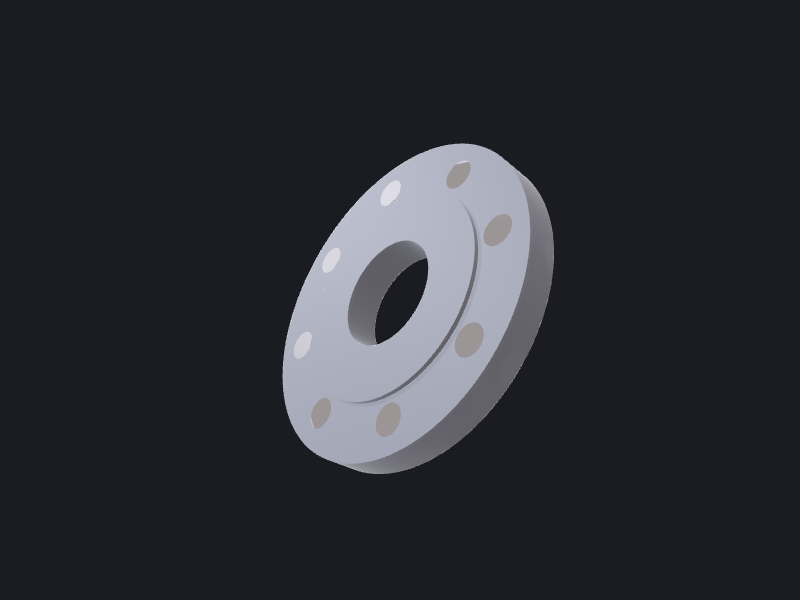

# Construction

`transform`, `boolean`, and `pattern` are headless, pure-function verbs: each reads one or two
BREP files, applies geometry in memory, and writes new BREP files. No scene, no history — just
BREP in → BREP out. That makes them trivially composable in a shell pipeline or a `--serve` JSONL
loop driven by OCCTMCP.

Full flag and JSON-form reference: [Construction reference](../../reference/construction.md).

---

**Scenario: a pipe-flange bolt-circle.** Starting from a pre-built flange disc (`flange.brep`)
and a single bolt-hole cylinder (`hole.brep`), we:

1. Circularly pattern the hole six times around the Z axis.
2. Subtract all six holes from the flange in one boolean.
3. Rotate the finished flange 90° to align it with the pipe axis.



---

## Step 1 — Circular-pattern the bolt hole

`pattern` takes one BREP and writes one file per instance into `--output-dir`. Circular mode
needs an axis origin, an axis direction, and a total count. Omitting `--total-angle` means a full
2π circle divided equally.

```bash
occtkit pattern hole.brep \
    --kind circular \
    --axis-origin 0,0,0 \
    --axis-direction 0,0,1 \
    --total-count 6 \
    --output-dir /tmp/holes
```

```json
{
  "outputPaths": [
    "/tmp/holes/pattern_0.brep",
    "/tmp/holes/pattern_1.brep",
    "/tmp/holes/pattern_2.brep",
    "/tmp/holes/pattern_3.brep",
    "/tmp/holes/pattern_4.brep",
    "/tmp/holes/pattern_5.brep"
  ],
  "totalCount": 6
}
```

Each `pattern_N.brep` is an independent solid — no parent-child linkage.

---

## Step 2 — Union the instances into a single tool body

`boolean` works on exactly two BREPs. Union the six hole instances progressively to build one
compound cutter. (Alternatively, union any existing compound from a prior step — each call is
still a pure two-input function.)

```bash
# Merge instances 0+1 → merged_01.brep
occtkit boolean --op union \
    --a /tmp/holes/pattern_0.brep \
    --b /tmp/holes/pattern_1.brep \
    --output /tmp/merged_01.brep
```

```json
{
  "outputPath": "/tmp/merged_01.brep",
  "volume": 1884.96,
  "isValid": true,
  "warnings": []
}
```

Repeat for the remaining instances, or script it:

```bash
cp /tmp/holes/pattern_0.brep /tmp/holes_all.brep
for i in 1 2 3 4 5; do
  occtkit boolean --op union \
      --a /tmp/holes_all.brep \
      --b /tmp/holes/pattern_$i.brep \
      --output /tmp/holes_all_next.brep
  mv /tmp/holes_all_next.brep /tmp/holes_all.brep
done
```

---

## Step 3 — Subtract the cutter from the flange

```bash
occtkit boolean --op subtract \
    --a flange.brep \
    --b /tmp/holes_all.brep \
    --output flange_drilled.brep
```

```json
{
  "outputPath": "flange_drilled.brep",
  "volume": 48210.3,
  "isValid": true,
  "warnings": []
}
```

`volume` is the enclosed solid volume in mm³. A `null` here would indicate a non-solid result
(open shell, degenerate faces) — treat that as a geometry problem upstream.

---

## Step 4 — Rotate to align with the pipe axis

`transform` applies translate → rotate → scale in that order. Pass `--rotate-axis-angle` as
`axisX,axisY,axisZ,radians`. Here a 90° rotation around the Y axis aligns the flange face with
the pipe's X axis.

```bash
occtkit transform flange_drilled.brep \
    --rotate-axis-angle 0,1,0,1.5708 \
    --output flange_final.brep
```

```json
{
  "outputPath": "flange_final.brep",
  "trsf": [
    6.123e-17, 0.0, -1.0, 0.0,
    0.0,       1.0,  0.0, 0.0,
    1.0,       0.0,  6.123e-17, 0.0,
    0.0,       0.0,  0.0, 1.0
  ]
}
```

`trsf` is the column-major 4×4 transformation matrix — useful when a downstream tool needs to
reproject points or normals without re-reading the BREP.

---

## Putting it together

```bash
# 1. Pattern
occtkit pattern hole.brep --kind circular \
    --axis-origin 0,0,0 --axis-direction 0,0,1 --total-count 6 \
    --output-dir /tmp/holes

# 2. Merge hole instances
cp /tmp/holes/pattern_0.brep /tmp/holes_all.brep
for i in 1 2 3 4 5; do
  occtkit boolean --op union \
      --a /tmp/holes_all.brep --b /tmp/holes/pattern_$i.brep \
      --output /tmp/holes_all_next.brep
  mv /tmp/holes_all_next.brep /tmp/holes_all.brep
done

# 3. Subtract
occtkit boolean --op subtract \
    --a flange.brep --b /tmp/holes_all.brep \
    --output flange_drilled.brep

# 4. Orient
occtkit transform flange_drilled.brep \
    --rotate-axis-angle 0,1,0,1.5708 \
    --output flange_final.brep
```

Each verb is independently restartable: if step 3 fails, fix `flange.brep` and re-run from
there. Nothing is cached between calls.

---

## JSON-form and `--serve`

All three verbs accept a JSON request on stdin (or as a `.json` positional argument), and all
support `--serve` for JSONL streaming — useful when OCCTMCP drives multiple operations without
forking a new process per call. The request keys match the flag names in camelCase: `inputBrep`,
`outputPath`, `outputDir`, `axisOrigin`, `totalCount`, etc. See the
[Construction reference](../../reference/construction.md) for the full field tables.
