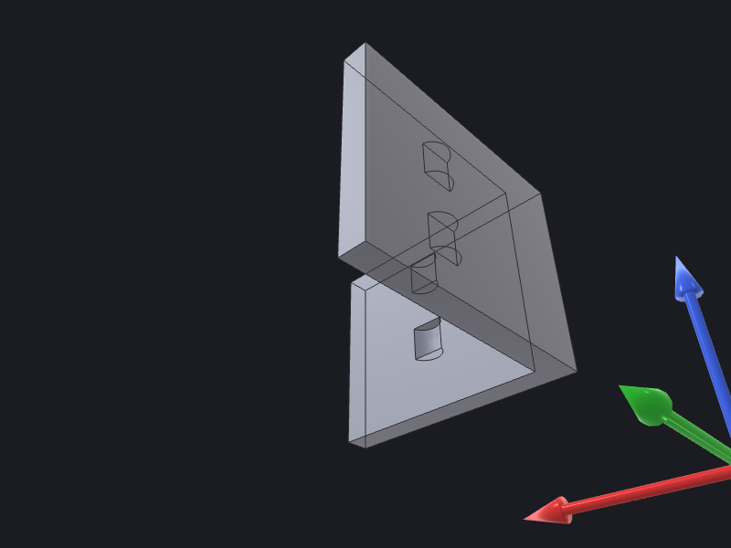

# Mesh & render

Three verbs cover the tessellation-to-preview pipeline: [`mesh`](../../reference/mesh.md#mesh) tessellates a B-rep solid and returns quality metrics; [`simplify-mesh`](../../reference/mesh.md#simplify-mesh) decimates that mesh to a target triangle budget; and [`render-preview`](../../reference/render.md#render-preview) produces a headless PNG from one or more BREPs with configurable camera, display mode, and AIS overlays. Each step is a single `occtkit` call that reads a BREP file and writes JSON to stdout.

---

## Step 1 — Tessellate and inspect quality

`mesh` runs `BRepMesh_IncrementalMesh` and returns triangle and vertex counts alongside four quality metrics. Omit `--output` to get inline geometry (up to the 100K-triangle threshold); supply it to write a `.stl` or `.obj` and suppress the vertex arrays.

`--linear-deflection` (mm) is the primary knob — smaller values produce more triangles and a more faithful surface. `--angular-deflection` (radians) caps the angle between adjacent triangle normals and matters most on curved faces. Run metrics-only first to calibrate before committing to a file write.

```bash
occtkit mesh part.brep \
    --linear-deflection 0.05 \
    --angular-deflection 0.3 \
    --parallel \
    --no-return-geometry
```

```json
{
  "triangleCount": 8214,
  "vertexCount": 4112,
  "quality": {
    "minAspectRatio": 1.04,
    "meanAspectRatio": 2.11,
    "degenerateTriangles": 0,
    "nonManifoldEdges": 0
  },
  "geometry": null,
  "outputPath": null
}
```

`minAspectRatio` and `meanAspectRatio` are longest-edge / shortest-edge per triangle (≥ 1; lower is better). `degenerateTriangles` counts near-zero-edge triangles; `nonManifoldEdges` counts undirected edges shared by a number of triangles other than exactly 2 — both should be 0 for a manifold solid.

Once the metrics look good, add `--output` to write the fine mesh for archiving:

```bash
occtkit mesh part.brep \
    --linear-deflection 0.05 \
    --angular-deflection 0.3 \
    --output /tmp/part_fine.stl
```

```json
{
  "triangleCount": 8214,
  "vertexCount": 4112,
  "quality": {
    "minAspectRatio": 1.04,
    "meanAspectRatio": 2.11,
    "degenerateTriangles": 0,
    "nonManifoldEdges": 0
  },
  "geometry": null,
  "outputPath": "/tmp/part_fine.stl"
}
```

---

## Step 2 — Decimate with simplify-mesh

`simplify-mesh` runs QEM decimation via OCCTSwiftMesh and always writes a file — `--output` is required. Target the triangle budget with `--target-reduction` (fraction to remove, 0.0–1.0) or `--target-triangle-count` (absolute cap); supply exactly one.

`--max-hausdorff-distance` acts as a quality gate: the verb aborts if the geometric deviation between original and decimated meshes exceeds the threshold. `--preserve-boundary` locks seam edges; `--preserve-topology` prevents genus changes. Both default to `true`.

```bash
occtkit simplify-mesh part.brep \
    --linear-deflection 0.05 \
    --target-reduction 0.75 \
    --max-hausdorff-distance 0.2 \
    --output /tmp/part_lod.obj
```

```json
{
  "beforeTriangleCount": 8214,
  "afterTriangleCount": 2054,
  "qualityDelta": {
    "meanAspectRatioDelta": 0.18,
    "hausdorffDistance": 0.14
  },
  "outputPath": "/tmp/part_lod.obj"
}
```

`hausdorffDistance` is the achieved geometric deviation in input units. Check it against your tolerance budget: if it is close to `--max-hausdorff-distance`, either loosen `--target-reduction` or tighten `--linear-deflection` on the upstream tessellation step to give the decimator more triangles to work with.

`meanAspectRatioDelta` is post-mesh minus pre-mesh mean aspect ratio — a positive value means quality improved (the decimator produced more equilateral triangles on average).

To hit an absolute triangle count instead:

```bash
occtkit simplify-mesh part.brep \
    --target-triangle-count 1000 \
    --output /tmp/part_web.stl
```

---

## Step 3 — Headless PNG preview

`render-preview` wraps `OCCTSwiftViewport`'s `OffscreenRenderer`. It loads one or more BREPs, converts each to a `ViewportBody`, fits a camera, and writes a PNG. The verb requires a Metal device — it runs on any Mac with Apple silicon or a discrete GPU; CI runners without Metal should omit this step or mock the output.

A standard iso-view render with edge overlay:

```bash
occtkit render-preview part.brep \
    --output /tmp/part_iso.png \
    --camera iso \
    --display-mode shaded-with-edges \
    --background light \
    --width 1200 \
    --height 900
```

```json
{
  "outputPath": "/tmp/part_iso.png",
  "width": 1200,
  "height": 900,
  "mimeType": "image/png"
}
```

### Axis overlay

Add `--show-axes` to place an AIS Trihedron. The default `--axes-position outside` anchors the trihedron 20 % of the bbox diagonal beyond the bbox-min corner, keeping all three arrows visible regardless of where the part sits in world space. Use `origin` to fix the trihedron at (0, 0, 0), `center` to place it at the bbox centre, or explicit `x,y,z` coordinates:

```bash
occtkit render-preview part.brep \
    --output /tmp/part_axes.png \
    --camera front \
    --display-mode shaded \
    --show-axes \
    --axes-position outside
```

### Highlight a sub-shape

`--highlight` extracts sub-shapes from the first input BREP and renders them in the highlight colour (default orange `#ffa500`). Sub-shape indices match those emitted by `query-topology` for cross-reference:

```bash
occtkit render-preview part.brep \
    --output /tmp/part_face.png \
    --camera iso \
    --display-mode shaded-with-edges \
    --highlight face[3],edge[7] \
    --highlight-color "#ff4400"
```

```json
{
  "outputPath": "/tmp/part_face.png",
  "width": 800,
  "height": 600,
  "mimeType": "image/png"
}
```

### Render a multi-BREP scene

Pass multiple BREP paths to composite them into one frame — useful for assembly previews. Sub-shape `--highlight` applies to the first input only; render that body solo if you need to highlight it within the scene.

```bash
occtkit render-preview housing.brep cover.brep shaft.brep \
    --output /tmp/assembly_iso.png \
    --camera iso \
    --display-mode shaded-with-edges \
    --background dark \
    --width 1600 \
    --height 1200
```

```json
{
  "outputPath": "/tmp/assembly_iso.png",
  "width": 1600,
  "height": 1200,
  "mimeType": "image/png"
}
```

### Example output



---

## Putting it together

A full tessellate-decimate-preview pipeline for a single part:

```bash
# 1. Check tessellation quality.
occtkit mesh part.brep \
    --linear-deflection 0.05 --angular-deflection 0.3 \
    --no-return-geometry

# 2. Write the fine mesh if metrics are acceptable.
occtkit mesh part.brep \
    --linear-deflection 0.05 --angular-deflection 0.3 \
    --output /tmp/part_fine.stl

# 3. Produce a lightweight LOD mesh for the web viewer.
occtkit simplify-mesh part.brep \
    --linear-deflection 0.05 \
    --target-reduction 0.75 \
    --max-hausdorff-distance 0.2 \
    --output /tmp/part_lod.obj

# 4. Render a PNG preview with axes.
occtkit render-preview part.brep \
    --output docs/guides/cookbook/images/render-preview-demo.png \
    --camera iso \
    --display-mode shaded-with-edges \
    --background light \
    --width 1200 --height 900 \
    --show-axes
```

See the [Mesh reference](../../reference/mesh.md) and [Render reference](../../reference/render.md) for the complete parameter tables and JSON-form equivalents.
