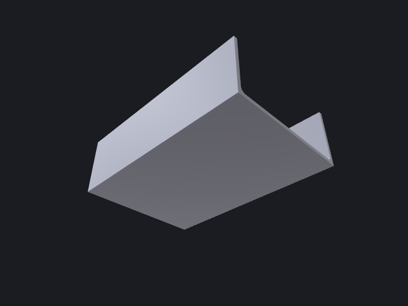

# Reconstruction & sheet metal

Two JSON-driven composition verbs that build BREP geometry without a script file:
`reconstruct` turns a `[FeatureSpec]` list into a solid; `compose-sheet-metal` folds flanges
and bends into a sheet-metal part. Both read from stdin or a file path and write a BREP under
`outputDir`. See [Composition reference](../../reference/composition.md) for every field.

---

## 1. `reconstruct` — feature list → BREP

`reconstruct` drives `OCCTSwift.FeatureReconstructor.buildJSON` (v0.147+). The request
envelope is a JSON object with four keys: `outputDir`, `outputName` (optional; default
`"reconstructed"`), `inputBrep` (optional; see below), and `features` — an array of feature
entries, each identified by a `kind` discriminator.

### Minimal example: revolve then drill

```bash
cat > /tmp/shaft.json <<'EOF'
{
  "outputDir": "/tmp/out",
  "outputName": "shaft",
  "features": [
    {
      "kind": "revolve",
      "id": "body",
      "profile_points_2d": [[0,0], [12,0], [12,60], [0,60]],
      "axis_origin":    [0, 0, 0],
      "axis_direction": [0, 0, 1],
      "angle_deg": 360
    },
    {
      "kind": "hole",
      "id": "centre_hole",
      "center":    [0, 0, 0],
      "direction": [0, 0, 1],
      "radius": 4,
      "depth": 60
    }
  ]
}
EOF
occtkit reconstruct /tmp/shaft.json
```

```json
{
  "shape": "/tmp/out/shaft.brep",
  "fulfilled": ["body", "centre_hole"],
  "skipped": [],
  "annotations": []
}
```

Exit code `0` means every feature was fulfilled. Exit code `2` means no features could be
built (partial builds where some features succeed still return `0`; check `skipped` for
details).

### Editing an existing body (`inputBrep` / `@input`)

Supply `inputBrep` to seed the build context with an existing solid. Hole, fillet, and
chamfer entries cut directly into it. Use a `boolean` entry with `"left": "@input"` for
non-circular pockets or any operation that needs to name the seed body explicitly:

```json
{
  "outputDir": "/tmp/out",
  "outputName": "shaft_v2",
  "inputBrep": "/tmp/out/shaft.brep",
  "features": [
    {
      "kind": "fillet",
      "id": "top_fillet",
      "edges": ["edge:0", "edge:1"],
      "radius": 1.5
    },
    {
      "kind": "boolean",
      "id": "keyway",
      "op": "subtract",
      "left": "@input",
      "right": "keyway_tool"
    }
  ]
}
```

The `boolean` kind (`op`: `"union"` | `"subtract"` | `"intersection"`) was added in
OCCTSwift v0.152.1 and requires both operands to already exist as named solids in the build
context; `"@input"` is the sentinel for the seeded body.

### Available feature kinds

| `kind` | Key fields |
|--------|-----------|
| `revolve` | `profile_points_2d`, `axis_origin`, `axis_direction`, `angle_deg` |
| `extrude` | `profile_points_2d`, `direction`, `length` |
| `hole` | `center`, `direction`, `radius`, `depth` |
| `thread` | `spec`, `hole_ref`, `length` (optional) |
| `fillet` | `edges`, `radius` |
| `chamfer` | `edges`, `distance` |
| `boolean` | `op`, `left`, `right` |

Every entry also carries an `id` string used in `fulfilled` / `skipped` / cross-references.
See the [Composition reference](../../reference/composition.md#reconstruct) for the full
field list.

---

## 2. `compose-sheet-metal` — flanges + bends → folded part

`compose-sheet-metal` drives `OCCTSwift.SheetMetal.Builder` (v0.151+). Each face of the
part is a `Flange` — a 2D profile placed in 3D by an `origin`, an in-plane `uAxis` (and
optional `vAxis`), and a `normal` along which thickness is extruded. `Bend`s round the
shared edges between adjacent flanges.

### The U-channel (worked example)

A base plate with two walls bent up on opposite long edges — the canonical robust part for
this builder.

```bash
cat > /tmp/channel.json <<'EOF'
{
  "outputDir": "/tmp/out",
  "outputName": "u_channel",
  "thickness": 1.5,
  "flanges": [
    {
      "id": "base",
      "profile": [[0,0],[80,0],[80,50],[0,50]],
      "origin": [0, 0, 0],
      "uAxis":  [1, 0, 0],
      "vAxis":  [0, 1, 0],
      "normal": [0, 0, 1]
    },
    {
      "id": "front",
      "profile": [[0,0],[80,0],[80,25],[0,25]],
      "origin": [0, 0, 0],
      "uAxis":  [1, 0, 0],
      "vAxis":  [0, 0, 1],
      "normal": [0, -1, 0]
    },
    {
      "id": "back",
      "profile": [[0,0],[80,0],[80,25],[0,25]],
      "origin": [0, 50, 0],
      "uAxis":  [1, 0, 0],
      "vAxis":  [0, 0, 1],
      "normal": [0, 1, 0]
    }
  ],
  "bends": [
    {"from": "base", "to": "front", "radius": 2.0},
    {"from": "base", "to": "back",  "radius": 2.0}
  ]
}
EOF
occtkit compose-sheet-metal /tmp/channel.json
```

```json
{
  "shape": "/tmp/out/u_channel.brep",
  "flanges": 3,
  "bends": 2
}
```



### Builder limitations

Keep these in mind when authoring specs:

- **Always set `vAxis` explicitly on walls.** The default `cross(normal, uAxis)` points
  downward for some edge orientations, folding the wall below the base and causing the bend
  fillet to fail.
- **Walls must span the full shared edge.** Corner relief cutouts or inset origins cause the
  bend fillet to fail — the builder rounds the entire shared edge.
- **No shared corners.** The builder handles chains and opposite flanges (U-channel,
  Z-bracket) but not two walls that meet at a corner. A four-wall tray or closed box is not
  buildable today. A U-channel is the reliable canonical part.
- **`build` throws `SheetMetal.BuildError`.** It is `CustomStringConvertible`; surface and
  log its message rather than force-unwrapping.

See the [Composition reference](../../reference/composition.md#compose-sheet-metal) for the
full field table.
