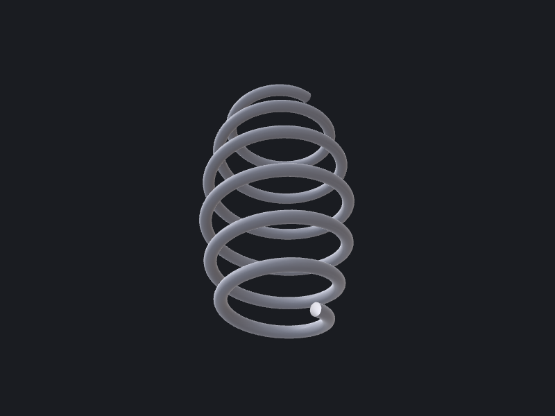
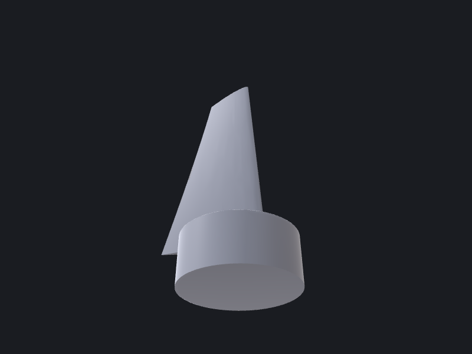
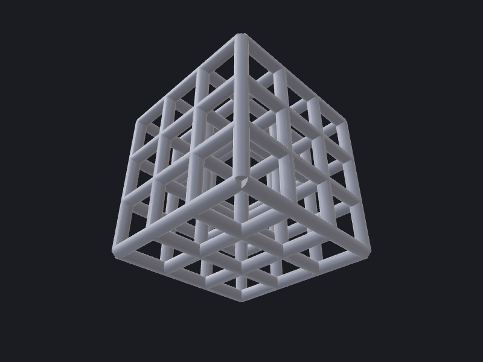

# Sweeps, lofts & patterns

Three techniques that take a simple primitive and multiply it into a complex solid:
**pipe sweeps** drag a cross-section along a 3D path; **lofts** skin a surface across a
stack of placed profiles; **linear patterns** tile a body along one or more axes and fuse
the copies. Each sub-recipe below is a worked example drawn from the
[`recipes/`](https://github.com/gsdali/OCCTSwiftScripts/tree/main/recipes) folder — run
the exact command shown to reproduce the output.

---

## 1 — Helix + pipe sweep (helical spring)

**Recipe:** `recipes/02-helical-spring/`

A constant-pitch compression spring: `Wire.helix` gives the coil centre-line; a circle
placed at its start point (oriented along the helix tangent) is swept along the path with
`Shape.sweep`, which wraps `BRepOffsetAPI_MakePipe`.

```swift
// Coil centre-line about Z
let path = Wire.helix(radius: meanRadius, pitch: pitch, turns: activeCoils)!

// Section at the helix start, facing along the start tangent
// Helix tangent at θ=0: (0, R, pitch/2π), normalised
let t = SIMD3<Double>(0, meanRadius, pitch / (2 * .pi))
let tLen = (t.x*t.x + t.y*t.y + t.z*t.z).squareRoot()
let tangent = t / tLen
let section = Wire.circle(origin: SIMD3(meanRadius, 0, 0),
                          normal: tangent, radius: wireDia / 2)!

let spring = Shape.sweep(profile: section, along: path)!
```

Run it:

```bash
swift run occtkit run recipes/02-helical-spring/main.swift --format brep
```



**Gotchas**

- The section circle **must** sit on the spine start and face along the tangent —
  an edge-on or offset section makes `BRepOffsetAPI_MakePipe` fail and returns `nil`.
- `Shape.sweep` orientation-normalises its result since OCCTSwift v1.3.1 (issue #170),
  so you never need to flip the section sense to avoid a negative-volume solid. Use
  `Shape.signedVolume` if you need to inspect raw orientation.
- `Wire.helix` takes `turns:` (a coil count), **not** a `height:`.
  Free length ≈ `pitch · turns`.
- Ground or closed ends are out of scope here — they require a variable-pitch helix or
  an end-grinding boolean.

---

## 2 — Lofted twisted sections (fan blade)

**Recipe:** `recipes/06-fan-blade/`

A tapered, twisted fan blade: six NACA-symmetric airfoil cross-sections are built at
spanwise stations, each scaled by the chord taper and rotated by the interpolated twist
angle, then skinned into a solid with `Shape.loft` (`BRepOffsetAPI_ThruSections`). A hub
cylinder is fused on at the root.

```swift
// Build one Wire per spanwise station: scale (taper) + rotate in-plane (twist)
for i in 0..<sections {
    let f = Double(i) / Double(sections - 1)
    let chord = rootChord * (1 - taper * f)
    let twist = (twistRootDeg + (twistTipDeg - twistRootDeg) * f) * .pi / 180
    let pts3d = baseAirfoil.map { p -> SIMD3<Double> in
        let sx = p.x * chord, sy = p.y * chord
        return SIMD3(sx * cos(twist) - sy * sin(twist),
                     sx * sin(twist) + sy * cos(twist),
                     f * span)
    }
    profiles.append(Wire.polygon3D(pts3d, closed: true)!)
}

guard var blade = Shape.loft(profiles: profiles, solid: true) else { fatalError("loft failed") }

// Hub boss fused at the root
let hub = Shape.cylinder(at: SIMD3(0, 0, -12), direction: SIMD3(0, 0, 1),
                         radius: rootChord * 0.55, height: 14)!
blade = blade.union(hub) ?? blade
```

Run it:

```bash
swift run occtkit run recipes/06-fan-blade/main.swift --format brep
```



**Gotchas**

- **Loft matches profiles by vertex index.** Every section must have the same point count
  in the same winding order. Generate all sections from one base loop and only transform
  the points — mismatched counts produce twisted or torn surfaces.
- Keep the trailing edge slightly open (the NACA TE is non-zero by formula). Coincident
  upper/lower TE points degenerate the wire.
- Large twist deltas across few sections can cause the loft to self-intersect. Add more
  `sections` if a steeply twisted blade fails or pinches.
- A full rotor is this blade repeated with `circularPattern` about the hub axis.

See the [Construction reference](../../reference/construction.md) for the `loft` verb's
`ruled` and `lastVertex` options.

---

## 3 — Linear pattern + union (strut lattice)

**Recipe:** `recipes/05-lattice-cube/`

A 3D-printable cubic strut lattice: for each axis, one full-length rod cylinder is built,
tiled into a grid by two chained `Shape.linearPattern` calls, and the three rod grids are
fused with `Shape.union` into a single watertight solid.

```swift
// One full-length rod per axis; two chained patterns tile a grid
func rodGrid(axis: SIMD3<Double>, tileA: SIMD3<Double>, tileB: SIMD3<Double>) -> Shape {
    let rod = Shape.cylinder(at: .zero, direction: axis, radius: strutR, height: span)!
    let row = rod.linearPattern(direction: tileA, spacing: cell, count: lines)!
    return row.linearPattern(direction: tileB, spacing: cell, count: lines)!
}

let xRods = rodGrid(axis: SIMD3(1,0,0), tileA: SIMD3(0,1,0), tileB: SIMD3(0,0,1))
let yRods = rodGrid(axis: SIMD3(0,1,0), tileA: SIMD3(1,0,0), tileB: SIMD3(0,0,1))
let zRods = rodGrid(axis: SIMD3(0,0,1), tileA: SIMD3(1,0,0), tileB: SIMD3(0,1,0))

let lattice = xRods.union(yRods)!.union(zRods)!
```

Run it:

```bash
swift run occtkit run recipes/05-lattice-cube/main.swift --format brep
```



**Gotchas**

- `linearPattern` is 1D — tile a 2D grid by chaining two calls on the result.
- Use full-length rods (spanning the whole lattice) rather than per-cell segments.
  Per-cell segments accumulate coincident faces at every node, making the union slower
  and more fragile.
- Cost scales with `(cells+1)² × 3` cylinders plus the final fuse — keep `cells` at 3–5
  for fast iteration; large lattices fuse slowly.
- This is a simple cubic (rods-only) lattice. Body-centred (BCC) or octet cells add
  diagonal struts — sweep them along `Wire.line` diagonals and union them the same way.

See the [Construction reference](../../reference/construction.md) for `linearPattern` and
`circularPattern` flag details.
