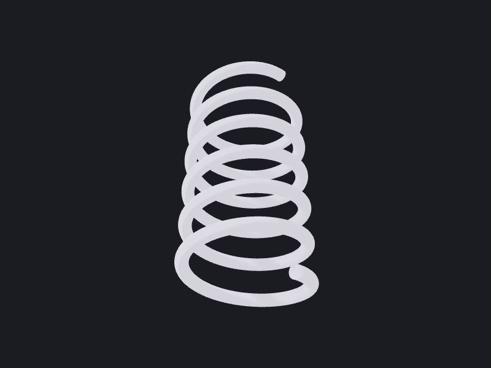

# 02: Helical compression spring

A constant-pitch, round-wire compression spring built by sweeping a circular section
along a helical path. The canonical "sweep a profile along a 3D curve" recipe.

## Parameters

| Name          | Default | Description                              | Valid range          |
|---------------|---------|------------------------------------------|----------------------|
| `wireDia`     | `4`     | Round-wire diameter (mm)                 | `> 0`, `< outsideDia`|
| `outsideDia`  | `40`    | Coil outside diameter (mm)               | `> wireDia`          |
| `pitch`       | `12`    | Axial distance between coils (mm)        | `> wireDia`          |
| `activeCoils` | `6`     | Number of active turns                   | `> 0`                |

Mean coil radius is derived: `meanRadius = (outsideDia − wireDia) / 2`.

## Algorithm

The coil centre-line is a helix about Z (`Wire.helix`). The wire cross-section is a
circle placed at the helix start point `(meanRadius, 0, 0)` and oriented along the start
tangent `(0, R, pitch/2π)`. The section is then swept along the helix with
`Shape.pipeShell(spine:profile:mode:solid:)` (which wraps
`BRepOffsetAPI_MakePipeShell`), passing `solid: true` so the swept ends are capped into
a genuine solid rather than an open tube surface (see Gotchas). `mode: .correctedFrenet`
keeps the round section true along the coil.

## OCCTSwift APIs used

- `Wire.helix(radius:pitch:turns:)`: the coil centre-line
- `Wire.circle(origin:normal:radius:)`: the wire cross-section
- `Shape.pipeShell(spine:profile:mode:solid:)`: pipe-sweep the section along the helix into a capped solid
- `Shape.volume`: sanity print

## Gotchas

- **Use `Shape.pipeShell(..., solid: true)`, not `Shape.sweep`, for a spring.**
  `Shape.sweep(profile:along:)` wraps `BRepOffsetAPI_MakePipe`, which never caps the
  ends of the swept tube, it returns a **shell** even for a closed circular profile
  (OCCTSwiftScripts #100). `Shape.pipeShell` wraps `BRepOffsetAPI_MakePipeShell`, which
  has an explicit `solid:` flag that caps the ends into a real solid. This is the
  documented canonical spring recipe (OCCTSwift cookbook, Helices & Springs).
- The section circle **must** sit on the spine start and face along the tangent, or the
  pipe sweep fails. Don't leave it at the origin.
- Ground/closed/squared ends are **out of scope**: this is an open-coil spring. Closed
  ends need either a variable-pitch helix or an end-grinding boolean.
- `Wire.helix` uses `turns:` (a coil count), **not** a `height:`. Free length ≈ `pitch ·
  activeCoils`.
- Checking a swept result: assert `shape.subShapeCount(ofType: .solid) >= 1`. Neither
  `shapeType` nor a positive `volume` is sufficient, since a shell reports a plausible
  volume and a compound wrapping one solid is healthy. If you are debugging a sweep's
  orientation rather than its topology, `Shape.signedVolume` inspects the raw sense and
  `orientedForward()` normalises it.
