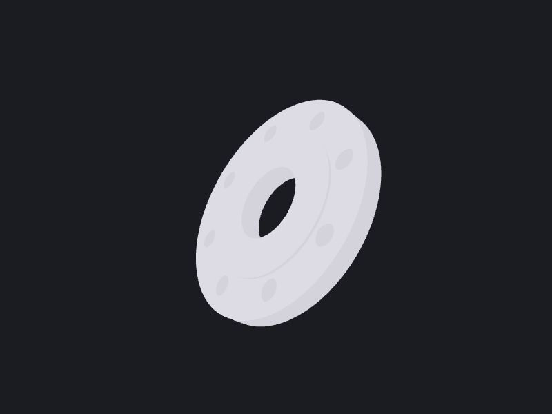

# 03: Pipe flange

A raised-face pipe flange with a bolt circle, built by revolving a half-section and
patterning a single bolt hole around the axis. Shows revolve + circular pattern + chamfer.

## Parameters

| Name               | Default | Description                          | Valid range                |
|--------------------|---------|--------------------------------------|----------------------------|
| `boreRadius`       | `25`    | Through-bore radius (mm)             | `> 0`, `< raisedRadius`    |
| `outerRadius`      | `75`    | Flange outer radius (mm)             | `> raisedRadius`           |
| `thickness`        | `15`    | Flange disk thickness (mm)           | `> 0`                      |
| `raisedRadius`     | `50`    | Raised-face outer radius (mm)        | `boreRadius … outerRadius` |
| `raisedHeight`     | `2`     | Raised-face height above disk (mm)   | `> 0`                      |
| `boltCircleRadius` | `60`    | Bolt-circle radius (mm)              | `raisedRadius … outerRadius` |
| `boltCount`        | `8`     | Number of bolt holes                 | `≥ 2`                      |
| `boltRadius`       | `7`     | Bolt-hole radius (mm)                | `> 0`, holes don't overlap |

## Algorithm

The flange is a surface of revolution. Its half-section is drawn in the XY plane as a
closed polygon of `(radius, axial)` pairs, bore wall, back face, OD, disk front, the
raised-face step, and back to the bore, with every radius `≥ boreRadius` so the profile
never crosses the axis. The section is faced with `Shape.face(from:)`, and the **face**
(not the wire) is revolved a full turn about the **Y axis** (the bore axis), which is
what closes the result into a solid rather than a shell (see Gotchas). The bolt circle
is cut with `Shape.circularPatternCut`: a single cylindrical hole tool is built at the
bolt-circle radius (oriented along Y), then patterned `boltCount` times around the axis
and subtracted as one compound. Finally a chamfer breaks the OD and the raised-face rim,
selected by geometry (a circle concentric with the revolve axis, at a known radius) rather
than by chamfering every edge; see Gotchas.

## OCCTSwift APIs used

- `Wire.polygon(_:closed:)`: the `(radius, axial)` half-section
- `Shape.face(from:)`: face the half-section before revolving
- `Shape.revolved(axisOrigin:axisDirection:)`: surface of revolution (on the faced section)
- `Shape.cylinder(at:direction:radius:height:)`: the bolt-hole tool
- `Shape.circularPatternCut(tool:axisPoint:axisDirection:count:angle:)`: the bolt circle (OCCTSwift v1.3.1)
- `Shape.edges(where:)`: select the OD and raised-face rim edges geometrically
- `Shape.chamferedWithFullHistory(distance:edges:)`: chamfer just those edges

## Gotchas

- **Face the wire before revolving it.** `Shape.revolve(profile: wire, ...)` revolves
  the curve itself and returns a **shell**, not a solid, this is standard
  `BRepPrimAPI_MakeRevol` behaviour on a wire, not an OCCTSwift bug (OCCTSwiftScripts
  #100). `Shape.face(from: wire)` followed by `face.revolved(...)` gives a solid with
  the same volume. `Shape.extrude(profile: wire, ...)` faces the wire for you and so does
  not have this trap, `Shape.revolve(profile: wire, ...)` does; the two aren't symmetric.
- The revolve axis is **Y**, so the half-section uses `x` for radius and `y` for axial
  position. Revolving an XY profile about Z would sweep a flat disk, not a solid.
- Keep every profile radius `≥ boreRadius`: a profile that touches or crosses the axis
  produces a degenerate or self-intersecting revolution.
- `Shape.chamfered(distance:)` blends **all** edges, and cannot build a chamfer at all on
  this shape (OCCTSwiftScripts #103): the revolve produces a seam edge on every periodic
  cylindrical face it creates, the bore, the OD, the raised-face wall, and each of the
  eight bolt holes, and `BRepFilletAPI_MakeChamfer` cannot resolve a blend on a seam,
  where both "adjacent" faces are really the same face. That failure held at every
  distance tested, from 1 mm down to 0.001 mm, so it is not a size problem, and it is not
  fixed by using a smaller chamfer. The recipe instead selects only the OD and the
  raised-face rim edges with `Shape.edges(where:)` and chamfers those with
  `Shape.chamferedWithFullHistory(distance:edges:)`, which avoids every seam. The step's
  base (where the disk-front annulus meets the raised-face wall) is left alone: it is a
  reentrant corner, so chamfering it adds material instead of breaking a corner, and
  chamfering it together with the rim exhausts the 2mm-tall wall and fails outright.
  A failed chamfer here is not swallowed: the recipe force-unwraps the result, so a
  regression crashes loudly instead of silently shipping an un-chamfered body.
- **The selector tests concentricity, not "some point at radius R".** It uses
  `centerOfCurvature(at:)` to require the circle's centre on the revolve axis, and
  `1 / curvature(at:)` for its true radius. Sampling one point and measuring its distance from
  the axis answers a weaker question, and would leave the exclusion of bolt-hole circles resting
  on the y-coordinate gate rather than on the geometry itself.
- **Excluding seams by `isCircle` alone only works for a polygonal profile.** A revolve's seam
  edges are the profile edges themselves, so with this straight-sided half-section they are
  lines. Put an arc or a fillet in the profile and the seam becomes circular, at which point
  `isCircle` stops excluding it. `Edge.isSeam(on:)` is the direct test if a variant ever needs
  one. Here the concentricity requirement excludes seams regardless, since a seam lies in a
  plane through the axis rather than on a circle around it.
- Use `circularPatternCut`, **not** `circularPattern`, for the bolt circle. `circularPattern`
  patterns the whole *body*, applied to a holed flange it produces overlapping flange copies
  (≈8× the volume) with the holes filled in. `circularPatternCut` patterns the *tool* and
  subtracts it, which is the feature-level behaviour you want here.
