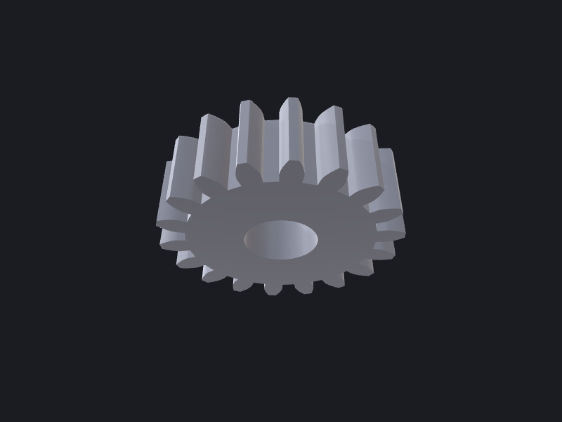

# 04 — Involute spur gear

A parametric involute spur gear (module / tooth count / pressure angle / face width) with
a central bore. The textbook "generate an involute tooth profile" recipe.

## Parameters

| Name               | Default | Description                          | Valid range            |
|--------------------|---------|--------------------------------------|------------------------|
| `module`           | `2`     | Pitch diameter per tooth (mm)        | `> 0`                  |
| `teeth`            | `18`    | Number of teeth                      | `≥ 6` (undercut below) |
| `pressureAngleDeg` | `20`    | Pressure angle (degrees)             | `14.5 … 25`            |
| `faceWidth`        | `12`    | Extrusion depth (mm)                 | `> 0`                  |
| `boreRadius`       | `6`     | Central bore radius (mm)             | `< rootRadius`         |
| `flankSamples`     | `8`     | Points sampled along each flank      | `≥ 4`                  |

Derived: pitch `r = module·teeth/2`, base `r·cos α`, addendum `r+module`, dedendum
`r−1.25·module`.

## Algorithm

The tooth flank is the **involute of the base circle**, `baseR·(cos t + t·sin t,
sin t − t·cos t)`, sampled over the roll angle `t` from the base circle out to the tip
radius. Each tooth is two mirrored flanks placed symmetrically about its centre: the
angular offset of a flank from the centre is the half-tooth angle at the pitch circle plus
the involute function `inv(α) = tan α − α` (the roll the involute accumulates between base
and pitch circles). Walking all `teeth` teeth — root point, up the right flank, down the
mirrored left flank, root point — produces one closed CCW polygon for the whole gear, which
is extruded to the face width and bored. OCCTSwift has no native involute primitive, so the
curve is sampled from its parametric form.

## OCCTSwift APIs used

- `Wire.polygon(_:closed:)` — the full sampled gear outline
- `Shape.extrude(profile:direction:length:)` — outline → gear blank
- `Shape.cylinder(at:direction:radius:height:)` + `Shape.subtracting(_:)` — central bore
- `Shape.volume` — sanity print

## Gotchas

- Below ~17 teeth at 20° the involute **undercuts** near the root; this recipe draws a
  straight root segment rather than a trochoid, so very low tooth counts look slightly off
  at the root. Raise `teeth` or `pressureAngleDeg` for clean roots.
- `flankSamples` trades smoothness for wire size — the flank is a sampled polyline, not an
  exact curve. 8 is plenty for rendering; raise it for meshing/analysis.
- The root is joined tooth-to-tooth by straight chords (no root-fillet arc). Good enough for
  visualisation; a load-bearing gear wants a proper trochoidal root fillet.
- No native `Curve2D.involute` exists yet in OCCTSwift — the math lives in the recipe.
