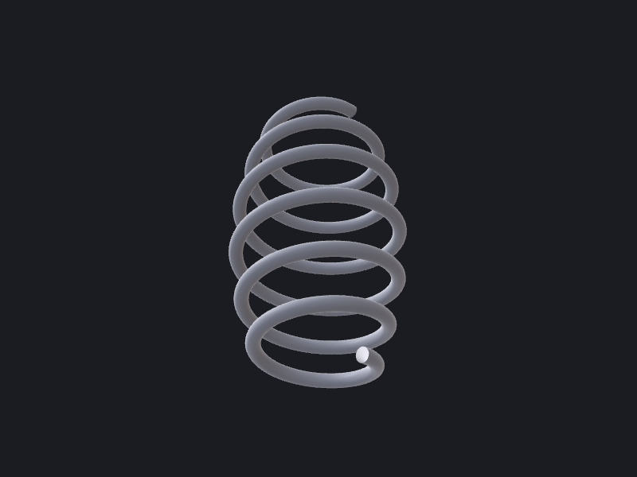

# OCCTSwiftScripts recipes

A cookbook of worked, parametric CAD examples — the OCCTSwift answer to CadQuery /
OpenSCAD examples. Each recipe is **self-contained**: open one folder, read three files,
understand the pattern. No shared utilities, no cross-recipe imports — copy a folder and
tweak the parameters.

## Recipes

| # | Recipe | Preview | What it shows |
|---|--------|---------|---------------|
| 01 | [Mounting bracket](01-mounting-bracket/) |  | sketch → 2D fillet → extrude → drill |
| 02 | [Helical compression spring](02-helical-spring/) |  | helix path + circular section → pipe sweep |
| 03 | [Pipe flange](03-pipe-flange/) |  | revolve + bolt-circle pattern + chamfer |

> Previews are locally-generated artifacts (`make recipes-render`). If an image is
> missing, the recipe still builds — PNGs are never a CI gate.

## Running a recipe

From the repo root:

```bash
swift run occtkit run recipes/01-mounting-bracket/main.swift --format brep --output /tmp/out
# → /tmp/out/body-0.brep + manifest.json (and output.step unless you pass --format brep)
```

Each recipe emits exactly **one** solid as `body-0`, committed alongside as `output.brep`
for diff-ability and CI reference comparison.

## Each recipe ships

- **`main.swift`** — ~30–60 lines: an `Inputs/Outputs/Notes` header, all parameters as named
  `let` constants up top, one `ctx.add(...)`, and a final `ctx.emit(...)`.
- **`README.md`** — one-line description, parameters table, algorithm, "OCCTSwift APIs used",
  gotchas, and the preview image.
- **`output.png`** — 800×600 isometric, dark background (via `render-preview`).
- **`output.brep`** — the reference body (CI compares volume + bounding box within tolerance).

## Tooling

```bash
make recipe NAME=my-widget   # scaffold recipes/NN-my-widget/ (auto-numbered)
make recipes-test            # run + smoke-test every recipe (occtkit run + metrics)
make recipes-render          # regenerate each output.png (skips cleanly without Metal)
```

`make recipes-test` is what CI runs (`.github/workflows/recipes.yml`, macOS, allowed-to-fail
during the seed batch).

## Planned recipes

This is a seed batch; the following are tracked for later additions (order/selection open):

- Spur gear (needs a hand-rolled involute — no `Curve2D.involute` yet)
- Sheet-metal enclosure (`compose-sheet-metal` + `reconstruct`)
- Lattice cube (linear pattern + sweep + boolean union)
- M8×40 bolt (hex head + helical thread)
- Finger-jointed lid box (2D profile composition — no wire booleans yet)
- Fan blade (lofted sections)
- Planetary gear set (XCAF assembly via `Document`)
